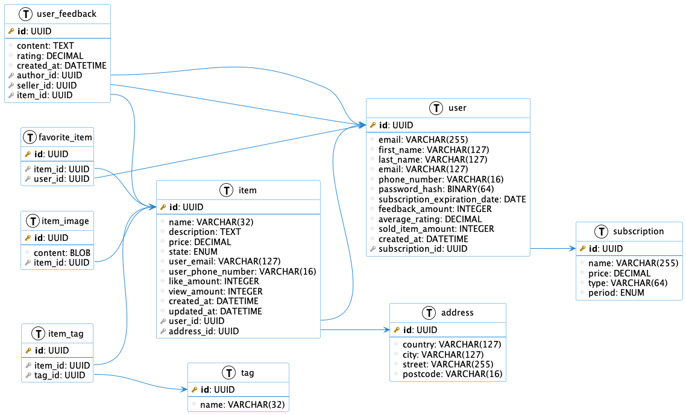

# Работа с UML

В этой лабораторной работе будем использовать [Plant UML](https://plantuml.com/). Инструкцию по установке вы можете найти [здесь](https://plantuml.com/faq-install). Если вы используете Mac OS, то установить `plantuml` можно с помощью `homebrew`:

```shell
brew install plantuml
```

# Внешний вид базы данных


